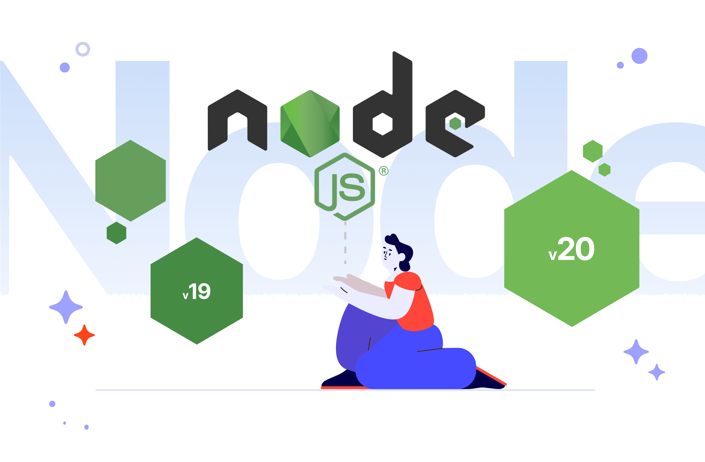

&nbsp;

&nbsp;

  
    
   
   &nbsp;&nbsp;&nbsp;&nbsp;&nbsp;
  

&nbsp;

sql
Jest
express js
mongo
oracle
sequelize
bitbucket
aws

&nbsp;
### Skills:

&nbsp;

### IDE/Tools:

&nbsp;

### Knowledge:

&nbsp;

### Hard Experience with UI software:

&nbsp;

#### I speak:
- :brazil: Brazilian Portuguese (native);
- :us: English (B1).

&nbsp;

 
